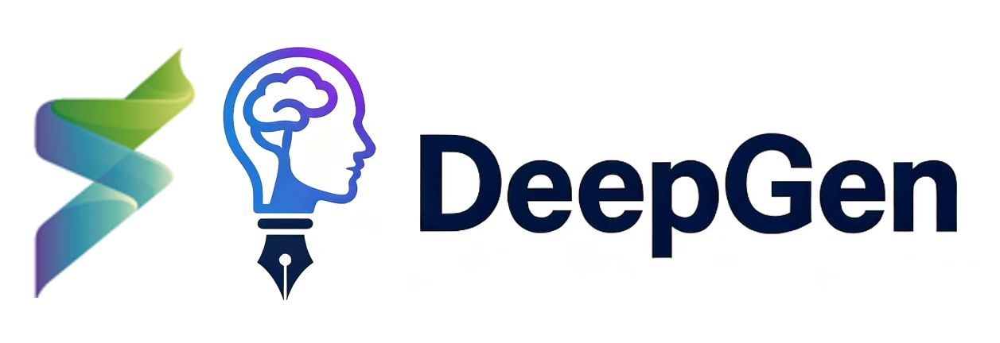

# Replacing Reinforcement Learning with Parameter-Efficient LLM Reasoning in Multimodal Diffusion Transformers

<p align="center">
  
</p>

<p align="center">
  <a href="https://www.biu.ac.il/en"></a>
  <a href="https://arxiv.org/abs/2602.12205"></a>
  <a href="https://huggingface.co/Qwen/Qwen2.5-3B-Instruct"></a>
  <a href="https://huggingface.co/Skywork/UniPic2-SD3.5M-Kontext-2B"></a>
  <a href="https://pytorch.org/"></a>
</p>

---

## 📖 Executive Summary

This repository contains the codebase, architectural implementation, streaming data pipelines, and Slurm cluster runbooks for a **Multimodal AI Seminar Research Project** at **Bar-Ilan University (BIU)**.

### The Research Question
Modern multimodal generative models (such as **DeepGen 1.0**) typically rely on an expensive three-stage training recipe: **(1) Alignment Pre-training**, **(2) Supervised Fine-Tuning (SFT)**, and **(3) Reinforcement Learning via Mixed-Reward GRPO (MR-GRPO)**. While Stage 3 (RL) improves fine-grained alignment and spatial coherence, it introduces extreme computational rollout overhead, reward hacking vulnerabilities, and training volatility.

> **Core Ablation Hypothesis:**  
> *Can augmenting an SFT-only generative backbone with frozen Large Language Model (LLM) reasoning representations match or surpass the RL-aligned model, thereby eliminating the complex and resource-heavy Reinforcement Learning stage?*

To investigate this hypothesis, we developed **`DeepGenSFTLLMAdapter`**—a parameter-efficient, zero-degradation warm-start architecture that injects linguistic and spatial reasoning signals from a frozen `Qwen2.5-3B-Instruct` backbone directly into the trained SFT conditioning stream with exact mathematical parity at Step 0.

---

## 🏛️ Baseline Acknowledgements & Upstream Credits

This ablation study builds directly upon pioneering open-source foundational models and frameworks:

* **[DeepGen 1.0 (Shanghai Innovation Institute)](http://arxiv.org/abs/2602.12205):** The baseline unified multimodal architecture integrating a 3B VLM, Stacked Channel Bridging (SCB) Connector, and a 2B DiT ([Hugging Face Model](https://huggingface.co/deepgenteam/DeepGen-1.0) | [GitHub Repository](https://github.com/deepgenteam/deepgen_rl)).
* **[Qwen2.5-VL (Alibaba Qwen Team)](https://arxiv.org/abs/2502.13923):** State-of-the-art vision-language model serving as the multimodal understanding backbone.
* **[UniPic2-SD3.5M-Kontext-2B (Skywork)](https://huggingface.co/Skywork/UniPic2-SD3.5M-Kontext-2B):** Flow-matching Diffusion Transformer (DiT) architecture with joint image-text self-attention.
* **[Qwen2.5 Language Model](https://huggingface.co/Qwen/Qwen2.5-3B-Instruct):** High-capacity 3B autoregressive text model providing spatial and relational commonsense reasoning.

---

## 🧠 Architectural Innovation: `DeepGenSFTLLMAdapter`

```
+-------------------------------------------------------------------------------------------------------------+
|                                  DEEPGEN SFT + LLM ADAPTER ARCHITECTURE                                     |
|                                                                                                             |
|  [ Trained DeepGen SFT Baseline (Frozen) ]                       [ Frozen Qwen2.5-3B LLM ]                  |
|    - Qwen2.5-VL-3B + Pretrained SCB Connector                      - Pure Text Language Model               |
|            |                                                               |                                |
|            v                                                               v                                |
|    (y_pool^base, c_seq^base)                                          H_LLM (B, L_txt, 2048)               |
|            |                  |                                            |           |                    |
|            |                  +-----------------------------\   /----------+           |                    |
|            |                                                 v v                       |                    |
|            |                                      [ Zero-Init Cross-Attn ]             |                    |
|            |                                       (Query: c_seq^base,                 |                    |
|            |                                        Key/Val: H_LLM)                    |                    |
|            |                                                 |                         v                    |
|            |                                                 v delta_c_seq    [ Zero-Init Pool MLP ]        |
|            |                                                 | (W_out=0)               |                    |
|            |       +-----------------------------------------+                         v delta_y_pool       |
|            |       |                                                                   | (W_out=0)          |
|            v       v                                                                   |                    |
|         c_seq = c_seq^base + delta_c_seq  (== c_seq^base at Step 0)                    |                    |
|            |                                                                           v                    |
|            +-------+-------------------------------------------------------------------+                    |
|                    v                                                                                        |
|                 y_pool = y_pool^base + delta_y_pool  (== y_pool^base at Step 0)                             |
|                    |                                                                                        |
|                    v                                                                                        |
|     [ UniPic2-SD3.5M-Kontext-2B DiT (Intact 18 Joint Blocks) ]                                              |
+-------------------------------------------------------------------------------------------------------------+
```

### Key Technical Properties:

1. **Zero Degradation at Step 0 (Exact SFT Parity):**
   The output projection weights of both the pooled adapter ($\mathbf{W}_{\text{pool}}=\mathbf{0}, \mathbf{b}_{\text{pool}}=\mathbf{0}$) and the sequence cross-attention adapter ($\mathbf{W}_{\text{out}}=\mathbf{0}, \mathbf{b}_{\text{out}}=\mathbf{0}$) are initialized to exact zeros. 
   $$\Delta y_{\text{pool}} \equiv \mathbf{0}, \quad \Delta c_{\text{seq}} \equiv \mathbf{0} \quad \implies \quad y_{\text{pool}} \equiv y_{\text{pool}}^{\text{base}}, \quad c_{\text{seq}} \equiv c_{\text{seq}}^{\text{base}}$$
   At initialization, the model produces **100.00% exact mathematical equivalence** to the trained DeepGen SFT checkpoint, completely eliminating the need for expensive alignment pre-training from scratch.
2. **Extreme Parameter Efficiency (~10.2M Trainable Parameters):**
   Only the lightweight zero-initialized adapter layers are optimized. The 3B VLM, 3B LLM, and 2B DiT backbones remain completely frozen in BF16 precision, reducing VRAM to ~22 GB per GPU.
3. **Omni-Modal Preservation (Generation + Editing):**
   Unlike text-only ablations that discard the vision encoder, our design preserves `Qwen2.5-VL-3B`'s native vision transformer for full multi-image editing support (ImgEdit, GEdit, RISE, UniREditBench).

---

## ⚡ Zero-Disk-Space Hugging Face Streaming Engine

Local disk quotas on high-performance compute clusters are strictly limited. All dataset loading and batch collation in this repository operate in **pure streaming mode (`streaming=True`)**, dynamically decoding raw bytes into in-memory `PIL.Image` buffers via `io.BytesIO` without writing intermediate cache files to disk.

```
+-------------------------------------------------------------------------------------------------------------+
|                                         HF STREAMING DATALOADING PIPELINE                                   |
|                                                                                                             |
|  [ Hugging Face Hub (Cloud) ]                                                                               |
|         |                                                                                                   |
|         +---> Stream 1: conceptual_captions (T2I) --------\                                                 |
|         |                                                  +--> [ HFStreamingJointDataset (50/50 Mix) ]     |
|         +---> Stream 2: iitolstykh/NHR-Edit (Editing) ----/                   |                             |
|                                                                               v                             |
|                                                                    [ Dynamic In-Memory Decode ]             |
|                                                                    (io.BytesIO -> PIL -> [-1, 1] Tensor)    |
|                                                                               |                             |
|                                                                               v                             |
|                                                                    [ CollateConcat Multi-Task Batch ]       |
|                                                                    - pixel_values: (B, 3, 512, 512)         |
|                                                                    - pixel_values_src: [(B, 3, 512, 512)]   |
|                                                                    - texts: list[str]                       |
+-------------------------------------------------------------------------------------------------------------+
```

### Supported Stream Sources:
* **Text-to-Image (T2I):** [Hugging Face `conceptual_captions`](https://huggingface.co/datasets/conceptual_captions) — Large-scale descriptive image-text pairs.
* **Instruction-Based Image Editing:** [Hugging Face `iitolstykh/NHR-Edit`](https://huggingface.co/datasets/iitolstykh/NHR-Edit) & [`UCSC-VLAA/GPT-Image-Edit-1.5M`](https://huggingface.co/datasets/UCSC-VLAA/GPT-Image-Edit-1.5M) — Multi-modal editing triplets `(source_image, instruction, target_image)`.
* **Multi-Task Interleaved Stream:** `HFStreamingJointDataset` dynamically balances 50% generation and 50% editing samples for unified omni-modal fine-tuning.

---

## 📁 Repository Structure

```
Semi/
├── REPORT.md                                          # Comprehensive academic research report & seminar paper
├── README.md                                          # Main repository landing page & documentation
├── TODO_ABLATION_NO_RL.md                             # Experiment tracking & execution roadmap
└── deepgen/
    ├── configs/
    │   ├── datasets/deepgen_512_fix_pixels/
    │   │   └── joint_sft_dual_stream_hf_stream.py     # Multi-task streaming dataset configuration
    │   ├── finetune/
    │   │   └── deepgen_sft_llm_adapter_hf_stream.py   # Stage B SFT config (DeepSpeed Zero-2 / DDP)
    │   └── models/
    │       └── deepgen_sft_llm_adapter.py             # Base model config loading SFT weights + Qwen2.5-3B
    ├── jobs/
    │   └── sft_llm_ablation.sbatch                    # Slurm batch submission script (A100-4h, 2 GPUs)
    ├── src/
    │   ├── datasets/text2image/
    │   │   └── hf_streaming_datasets.py               # Zero-disk HF streaming dataset adapters
    │   └── models/sd3_kontext/
    │       ├── deepgen_sft_llm_adapter.py             # DeepGenSFTLLMAdapter model architecture
    │       └── transformer_sd3_dynamic.py             # SD3.5 Kontext DiT backbone
    ├── model_zoo/                                     # Base pretrained weights (VLM, DiT, SFT checkpoint)
    ├── scripts/
    │   ├── evaluation/                                # Benchmark evaluation scripts (GenEval, WISE, etc.)
    │   └── train.py                                   # Training execution driver
    └── EVAL.md                                        # Official benchmark evaluation guide
```

---

## 🚀 Slurm Execution Runbook (BIU Cluster Setup)

The training pipeline is fully configured for the **Bar-Ilan University (BIU) Slurm Cluster** public partition `A100-4h` (4-hour time limit, automatic requeueing, 2x NVIDIA A100-80GB GPUs).

### 1. Launch Training Job

```bash
cd /home/dsi/davidpo/projects/Semi/deepgen
sbatch jobs/sft_llm_ablation.sbatch
```

### 2. Monitor Job & Live Logs

```bash
# Check queue status
squeue -u $USER

# Stream live training outputs
tail -f logs/ablation_sft_llm/sft_*.out
```

### 3. Slurm Preemption & Resumption Guarantees

The Slurm script handles job preemption and automatic requeueing (`#SBATCH --requeue`):
* `CheckpointHook` writes atomic state dicts every **1,000 steps** into `./work_dirs/sft_llm_ablation/`.
* When a 4-hour job times out and is requeued by the BIU scheduler, the launcher automatically discovers the latest saved checkpoint (`LATEST_CKPT=$(ls -t work_dirs/sft_llm_ablation/*.pth | head -1)`) and passes `--resume $LATEST_CKPT` to seamlessly resume without restarting from step 0.

---

## 📊 Benchmark Evaluation Protocol

Following training, the fine-tuned adapter checkpoint is benchmarked against the official **DeepGen 1.0 SFT Baseline** and **DeepGen 1.0 RL Reference** across standard benchmark suites:

### 1. Text-to-Image Generation Benchmarks
```bash
# GenEval (Compositionality & attribute binding)
python scripts/evaluation/gen_eval.py --config configs/models/deepgen_sft_llm_adapter.py

# DPGBench (Dense prompt comprehension)
python scripts/evaluation/dpg_bench.py --config configs/models/deepgen_sft_llm_adapter.py

# WISE (Commonsense & spatial reasoning)
python scripts/evaluation/wise.py --config configs/models/deepgen_sft_llm_adapter.py
```

### 2. Instruction-Based Image Editing Benchmarks
```bash
# ImgEdit & GEdit (Subject-background consistency & instruction following)
python scripts/evaluation/img_edit.py --config configs/models/deepgen_sft_llm_adapter.py
python scripts/evaluation/gedit.py --config configs/models/deepgen_sft_llm_adapter.py

# RISE & UniREditBench (Reasoning image editing)
python scripts/evaluation/rise_bench.py --config configs/models/deepgen_sft_llm_adapter.py
python scripts/evaluation/unireditbench.py --config configs/models/deepgen_sft_llm_adapter.py
```

---

## 📝 Research Report

For the complete academic treatment, mathematical formulations, compute trade-off matrices, and structured comparative result tables, please refer to:

👉 **[REPORT.md](../REPORT.md)** — *Full Seminar Project Technical Report*

---

## 📜 Citation & References

```bibtex
@article{wang2026deepgen,
  title={DeepGen 1.0: A Lightweight Unified Multimodal Model for Advancing Image Generation and Editing},
  author={Wang, Dianyi and Li, Ruihang and Han, Feng and Ma, Chaofan and Song, Wei and Wang, Siyuan and Wang, Yibin and Xin, Yi and Liu, Hongjian and Zhang, Zhixiong and others},
  journal={arXiv preprint arXiv:2602.12205},
  year={2026}
}

@article{qwen25vl2025,
  title={Qwen2.5-VL Technical Report},
  author={Qwen Team},
  journal={arXiv preprint arXiv:2502.13923},
  year={2025}
}
```
